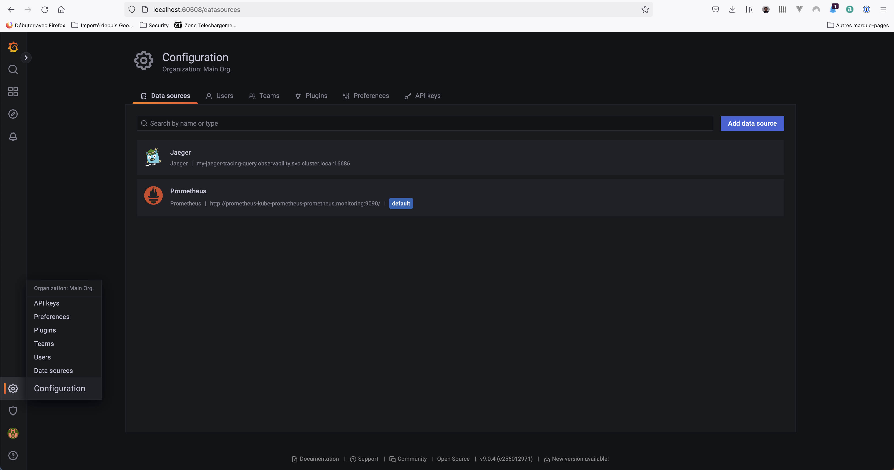
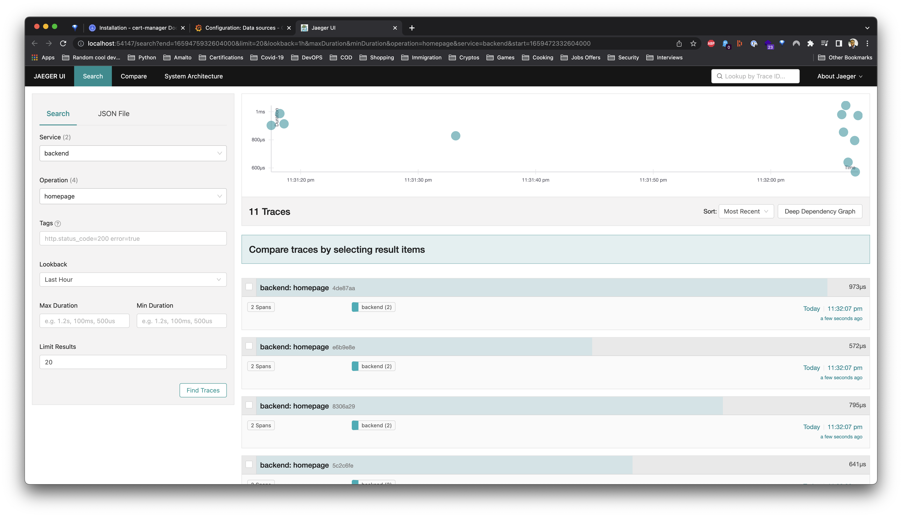

**Note:** For the screenshots, you can store all of your answer images in the `answer-img` directory.

## Verify the monitoring installation

*TODO:* run `kubectl` command to show the running pods and services for all components. Take a screenshot of the output and include it here to verify the installation

## Setup the Jaeger and Prometheus source
*TODO:* Expose Grafana to the internet and then setup Prometheus as a data source. Provide a screenshot of the home page after logging into Grafana.

## Create a Basic Dashboard
*TODO:* Create a dashboard in Grafana that shows Prometheus as a source. Take a screenshot and include it here.

## Describe SLO/SLI
*TODO:* Describe, in your own words, what the SLIs are, based on an SLO of *monthly uptime* and *request response time*.
* Describe, in your own words, what the SLIs are, based on an SLO of *monthly uptime* and *request response time*.
SLIs stand for Service Level Indicators, it is a specific metric used to measure a performance of a service.
Based on an SLO of monthly uptime and request response time, SLIs are the measurement of the SLO. SLIs expose on
real time how a service is performing to show whether the SLOs is achieved.

## Creating SLI metrics.
*TODO:* It is important to know why we want to measure certain metrics for our customer. Describe in detail 5 metrics to measure these SLIs. 
1. Request Latency: The time taken to serve a request (usually measured in ms).
2. System Throughput: The requests per second.
3. Uptime: A percentage of availability during a specific period (minutes or hours ect..).
4. Traffic: The amount of stress on a system from demand (such as the number of HTTP requests/second.
5. Error Rate: The errors often expressed as a fraction of all requests received. (eg. percentage of HTTP 500 responses).
## Create a Dashboard to measure our SLIs
*TODO:* Create a dashboard to measure the uptime of the frontend and backend services We will also want to measure to measure 40x and 50x errors. Create a dashboard that show these values over a 24 hour period and take a screenshot.

## Tracing our Flask App
*TODO:*  We will create a Jaeger span to measure the processes on the backend. Once you fill in the span, provide a screenshot of it here. Also provide a (screenshot) sample Python file containing a trace and span code used to perform Jaeger traces on the backend service.

## Jaeger in Dashboards
*TODO:* Now that the trace is running, let's add the metric to our current Grafana dashboard. Once this is completed, provide a screenshot of it here.

## Report Error
*TODO:* Using the template below, write a trouble ticket for the developers, to explain the errors that you are seeing (400, 500, latency) and to let them know the file that is causing the issue also include a screenshot of the tracer span to demonstrate how we can user a tracer to locate errors easily.

TROUBLE TICKET

Name: Backend- Http 500 Error

Date: 02/08/2022

Subject: MongoDB service missing

Affected Area: Endpoint: /star

Severity: High

Description: The MongoDB Service does not exists which is why it's failing to process POST requests to /star.

## Creating SLIs and SLOs
*TODO:* We want to create an SLO guaranteeing that our application has a 99.95% uptime per month. Name four SLIs that you would use to measure the success of this SLO.
1. Uptime - Services should be up and running for at least 99.999% of the time on monthly basis.
2. Http Error Rate - Services returning 20x HTTP status should be <= 98% (per month) - Error per second <= 0.05% of the requests.
3. Http request latency - Requests responses should less than 50ms.
4. CPU and Memory usage - Services should not overload.
## Building KPIs for our plan
*TODO*: Now that we have our SLIs and SLOs, create a list of 2-3 KPIs to accurately measure these metrics as well as a description of why those KPIs were chosen. We will make a dashboard for this, but first write them down here.
1. Uptime (pod uptime):
* Backend uptime
* Frontend uptime
2. 4XX and 5XX errors
* Number of successful request / number of failing requests (for frontend|backend)
3. Traffic:
* Average response time
4. Resources Usage:
* CPU usage
* RAM usage
* Disk usage

## Final Dashboard
*TODO*: Create a Dashboard containing graphs that capture all the metrics of your KPIs and adequately representing your SLIs and SLOs. Include a screenshot of the dashboard here, and write a text description of what graphs are represented in the dashboard.  
